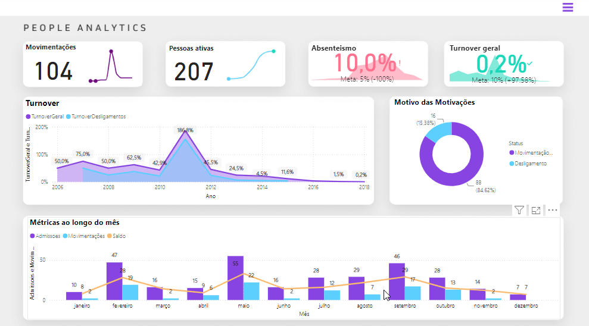

# Projeto Dashboard People Analytcs 

Este projeto foi desenvolvido durante a formação Power BI na Alura, no curso "Power BI: explorando recursos visuais". O foco foi explorar recursos avançados do Power BI, como perguntas e respostas interativas, previsão de tendências, detecção de anomalias e construção de KPIs, além de trabalhar com personalização visual, menus interativos e muito mais.

### :computer: Sobre o Projeto

A Tech Safe, empresa fictícia especializada em soluções tecnológicas, está em processo de transformação digital. Com base nesse cenário, o departamento pessoal solicitou um relatório dinâmico que acompanhasse as principais métricas de Recursos Humanos, orientando a tomada de decisão com base em dados.

O projeto tem como objetivo responder questões importantes como:
1. Quantas admissões e movimentações ocorrem por mês?
2.	Qual o número atual de colaboradores ativos?
3.	Quantas pessoas já foram desligadas ou movimentadas, e quais os motivos dessas mudanças?
4.	Como está o absenteísmo em relação à meta de 5%?
5.	Qual o turnover atual da empresa comparado à meta de 10%?
6.	Personalização por filtros como ano e departamento/cargo.

  

### :pushpin: Funcionalidades do projeto
- `Movimentações`: Total de movimentações ao longo do tempo.
- `Pessoas Ativas`: Evolução do número de colaboradores ativos.
- `Absenteísmo`: Comparação da taxa de absenteísmo atual com a meta estipulada.
- `Turnover Geral`: Comparação do turnover atual com a meta.
- `Histórico de Turnover`: Gráfico de linha mostrando a evolução do turnover e desligamentos ao longo dos anos.
- `Motivos das Movimentações`: Gráfico de rosca detalhando as razões de movimentações e desligamentos.
- `Métricas Mensais`: Gráfico de barras com admissões, movimentações e saldo por mês.
- `Métricas ao Longo do Mês `: Um gráfico de barras com a linha de tendência mostra as admissões, movimentações e saldo de movimentações de funcionários ao longo dos meses de um ano.
- `Filtros`: Ano e posição área de atuação dentro da empresa.

### :bar_chart: Insights das Visualizações
1.	Motivos de Desligamento (Gráfico de Rosca): Mais de 60% das saídas voluntárias foram devido à nova cultura implementada na empresa, indicando a necessidade de estratégias de adaptação.

   

3.	Turnover ao Longo dos Anos (Gráfico de Linha): O pico de desligamentos em 2011 é atribuído a uma fusão, e a nova cultura reduziu o turnover de desligamentos a zero a partir de 2016.

   

4. Contratação (Gráfico de linha): Apesar da redução nos desligamentos, apenas uma pessoa foi contratada em 2018, indicando uma estagnação no crescimento da força de trabalho. O fraco investimento em marketing e a dificulta na captação de novos clientes, resultando em menor necessidade de novas contratações.

   

### :hammer: Softwares e tecnologias Utilizadas
- `Power BI`
- `Excel`
- `Kaggle `

### :open_file_folder: Como Abrir e Rodar o Projeto
1.	Baixe as bases de dados e o arquivo `.pbix`.
2.	Abra o Power BI e carregue o arquivo `.pbix` junto com os datasets na mesma pasta.
3.	O projeto estará pronto para visualização.

### :bulb: Contato
Se este projeto te ajudou, não esquece de me seguir! ✨ Fico super feliz em receber sugestões de melhorias ou dicas para continuar evoluindo! Pode me chamar no Linkedin ou mandar um e-mail, vou adorar conversar com você! 😊📩
- Email: rlarissa191@gmail.com
- Linkedin: https://www.linkedin.com/in/larissa-de-almeida-ribeiro-212214197/
